# GISA - Gestão Integral da Saúde do Associado

### Repositório contendo a POC do Trabalho de Conclusão do Curso de Especialização em Arquitetura de Software Distribuído pela PUC Minas

&nbsp;

# Pré-requisitos

1. Ter o Docker instalado e configurado com o modo Swarm ativo.
2. Certificado digital válido. Este é opcional, porém, o proxy reverso (NGINX) foi configurado para procurar pelos arquivos **fullchain1.pem** e **privkey1.pem** no caminho /etc/letsencrypt/archive/poc-tcc-host.

&nbsp;

## Subindo a Stack

A solução é baseada em containers, portanto, com um único comando, todos os componentes podem ser iniciados com a instrução:

`docker stack deploy -c docker-stack-azure.yml gisa`

&nbsp;

# Macro Arquitetura

# Componentes

## RabbitMQ
Mensageria

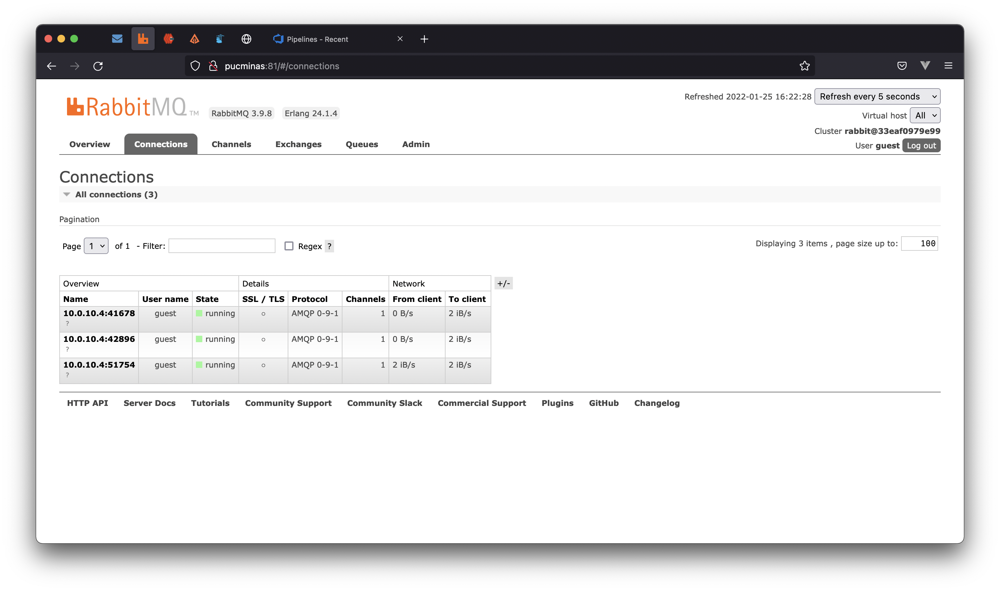

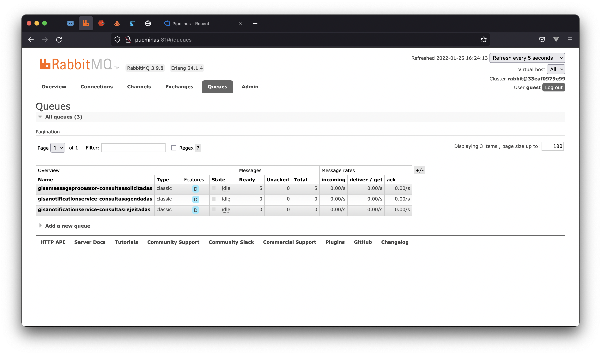

## Redis e Redis Commander
Cache

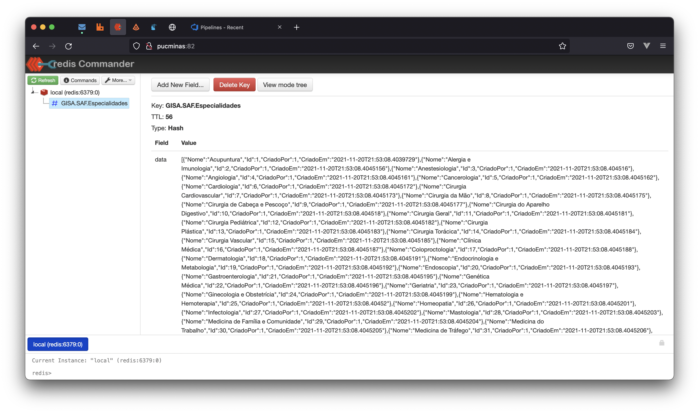

## MailDev
E-mails de confirmação/recusa de consulta

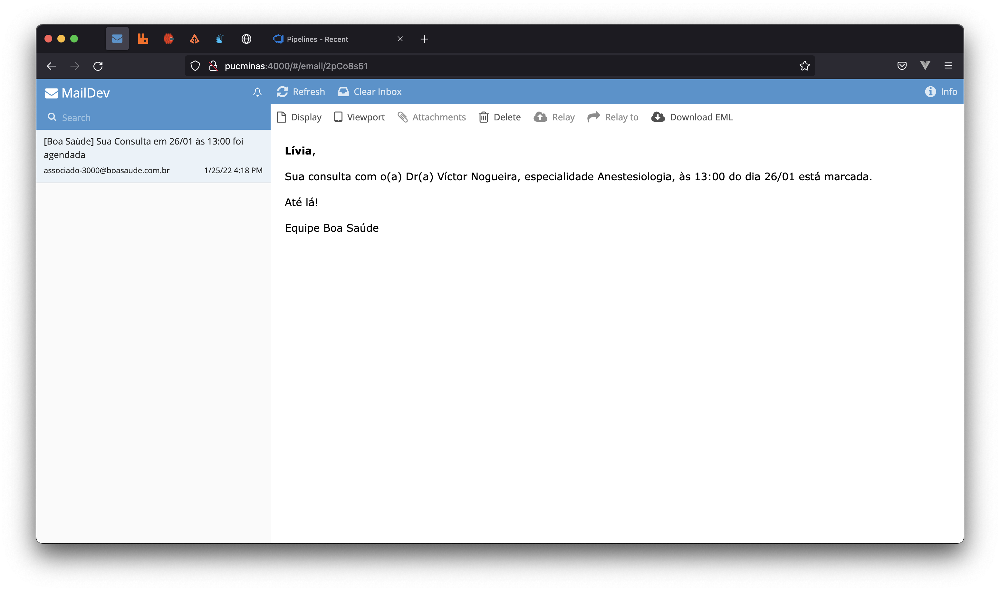

## Zipkin
Rastreabilidade entre microserviços

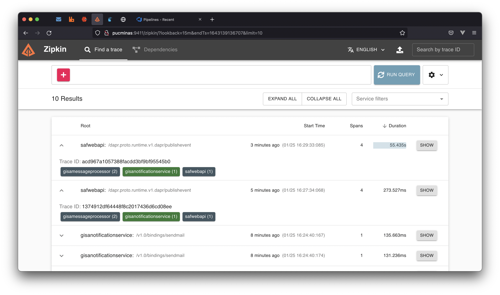

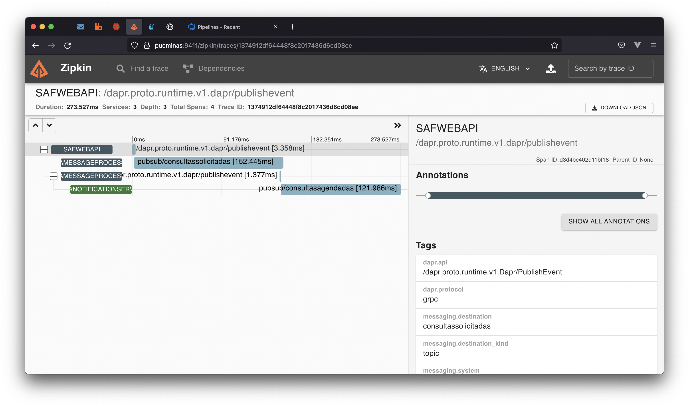

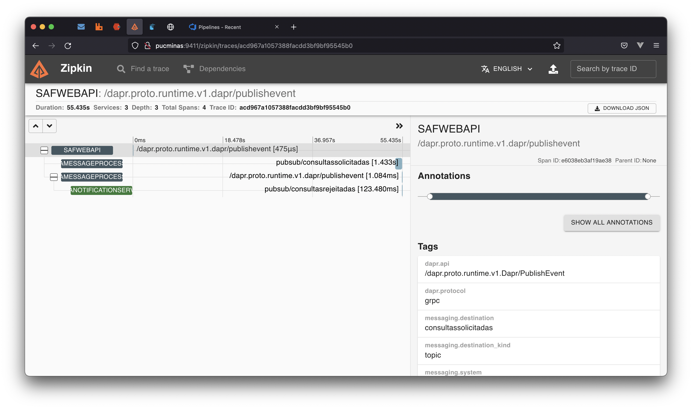

## Azure Pipelines
CI/CD

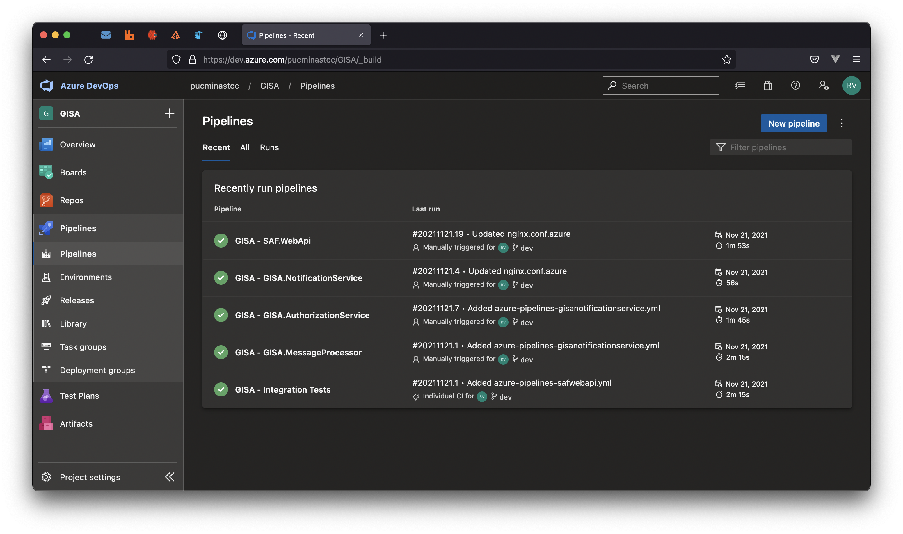

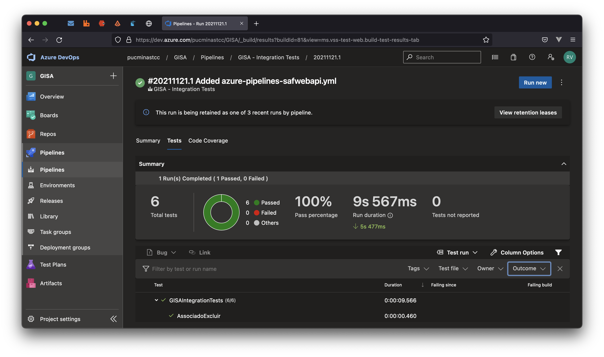

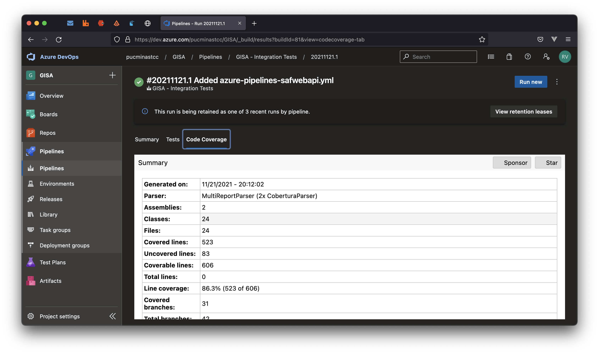

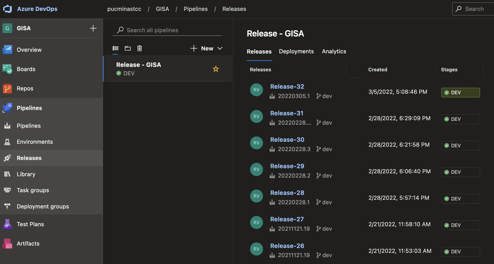

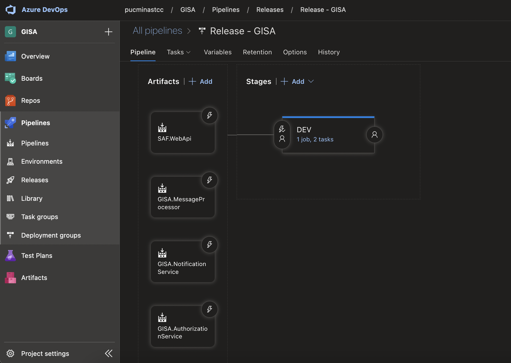

## Azure Application Insights
Logs e Telemetria

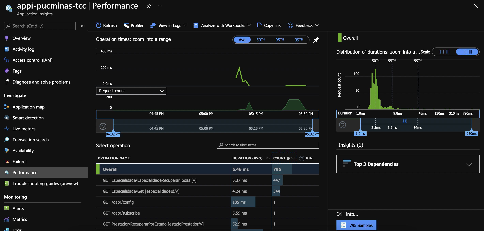

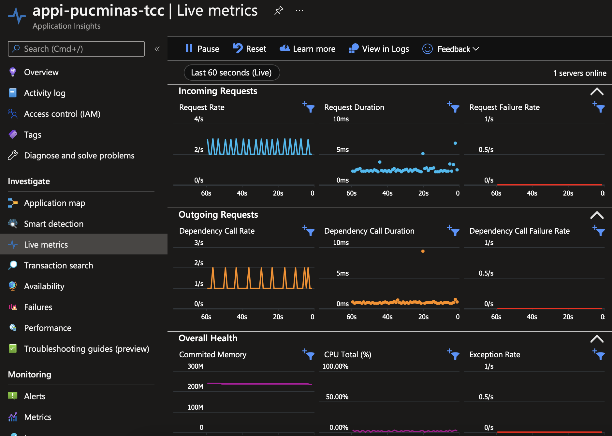

## Portainer
Gestão e monitoramento de containers

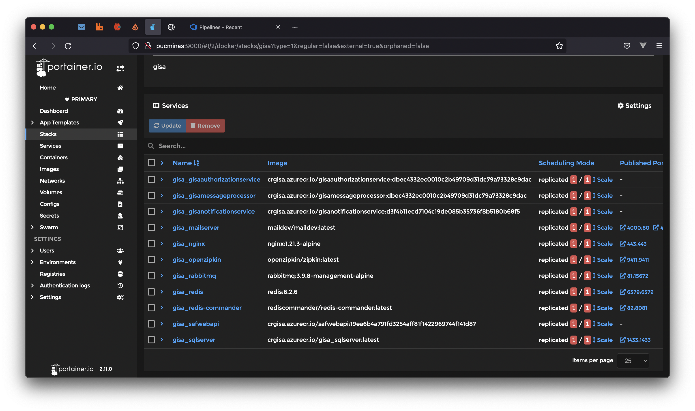

## Referências

[Azure Application Insights](https://docs.microsoft.com/en-us/azure/azure-monitor/app/app-insights-overview) - *Application Insights is a feature of Azure Monitor that provides extensible application performance management (APM) and monitoring for live web apps.*

[Azure Pipelines](https://azure.microsoft.com/en-us/services/devops/pipelines) - *Automate your builds and deployments with Pipelines so you spend less time with the nuts and bolts and more time being creative.*

[Dapr](https://dapr.io) - ***Dapr** is a portable, event-driven runtime that makes it easy for any developer to build resilient, stateless and stateful applications that run on the cloud and edge and embraces the diversity of languages and developer frameworks.*

[NGINX](https://nginx.com) - ***NGINX** is open source software for web serving, reverse proxying, caching, load balancing, media streaming, and more.*

[Portainer](https://www.portainer.io) - *At its heart, **Portainer** helps developers deploy cloud-native applications into containers simply, quickly and securely.*

[RabbitMQ](https://www.rabbitmq.com) - ***RabbitMQ** is the most widely deployed open source message broker.*

[Redis](https://redis.io) - ***Redis** is an open source (BSD licensed), in-memory data structure store, used as a database, cache, and message broker.*

[Zipkin](https://zipkin.io) - ***Zipkin** is a distributed tracing system. It helps gather timing data needed to troubleshoot latency problems in service architectures. Features include both the collection and lookup of this data.*